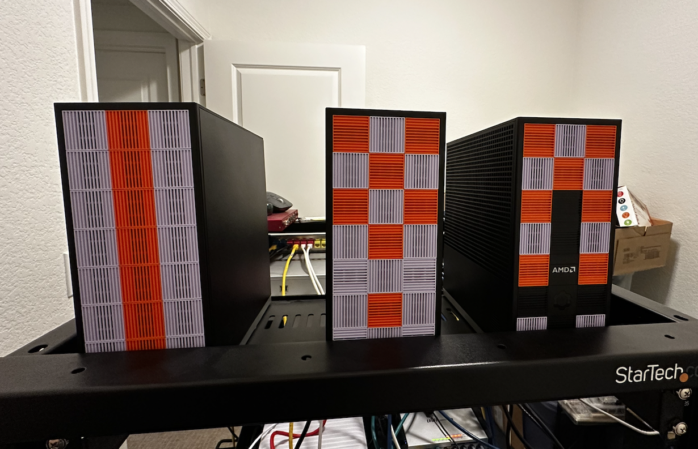

I had three Framework Desktops sitting on my desk doing nothing. Ryzen AI Max 300 APUs, 128 GB of unified memory each, a Micron 7450 960GB NVMe in each one dedicated to storage. Way overpowered for a homelab cluster. I wanted a Kubernetes setup I could tear down and rebuild in under 20 minutes, with no cloud, no VMs, just bare metal Fedora and Ansible.

That's what I built.

## The machines

Three identical Framework Desktops. Small, quiet, ridiculous specs for what most people use homelabs for. Each one runs as a K3s server (control plane and worker on every node). At this scale, splitting into dedicated control plane and worker nodes just wastes capacity. Three servers gives me an etcd quorum, so I can lose a node and keep running. Every node runs workloads.

## Ripping out the k3s defaults

K3s ships with Klipper for service load balancing and a bundled Traefik for ingress. I disabled both on day one.

```bash
curl -sfL https://get.k3s.io | sh -s - server \
  --cluster-init \
  --token "{{ k3s_token }}" \
  --tls-san "{{ kubevip_vip }}" \
  --write-kubeconfig-mode 644 \
  --disable servicelb \
  --disable traefik
```

`--cluster-init` starts embedded etcd on the first node. The other two join with `--server https://192.168.60.40:6443`, which is the kube-vip floating VIP, not the init node's real IP. This matters. If the init node goes down, the other two still reach the API through the VIP. The join process itself goes through the HA path from the start.

## Networking

### kube-vip

The API server needs a stable address that doesn't follow a single node. I picked kube-vip in ARP/L2 mode because it runs inside the cluster as a DaemonSet. No extra machine, no external load balancer, no DNS tricks.

The manifests get templated into `/var/lib/rancher/k3s/server/manifests/` before k3s even starts. When k3s comes up, it auto-deploys them. Leader election picks one node to hold the VIP (`192.168.60.40`), and if that node dies, another takes over within seconds.

I considered HAProxy + keepalived but that would've meant a fourth machine or running it on the nodes outside of Kubernetes. Didn't want that.

### MetalLB

Klipper pins each LoadBalancer service to a single node. If that node reboots (which mine do, regularly, for firmware and kernel updates) the service IP disappears until it comes back. MetalLB in L2 mode advertises service IPs via ARP and fails over to another speaker within seconds.

The VIP and the MetalLB pool live on the same subnet but don't overlap:

| Address | Purpose |
|---------|---------|
| 192.168.60.40 | kube-vip (API VIP) |
| 192.168.60.100-102 | Node IPs |
| 192.168.60.200-220 | MetalLB service pool |

No overlap, no conflicts, easy to debug.

### Traefik (self-managed)

The bundled Traefik upgrades automatically whenever you upgrade k3s. That's fine until you need to pin a version or customize the Helm values. I deploy my own via `kubernetes.core.helm` and it picks up an external IP from MetalLB automatically.

## One command

The entire deployment is `ansible-playbook site.yml`. No manual SSH. No "now run this on node 2." No copying kubeconfigs around.

```yaml
# site.yml
- name: Prepare all nodes
  ansible.builtin.import_playbook: playbooks/node-prep.yml

- name: Initialize first K3s server
  ansible.builtin.import_playbook: playbooks/k3s-init.yml

- name: Join remaining K3s servers
  ansible.builtin.import_playbook: playbooks/k3s-join.yml

- name: Deploy post-install components
  ansible.builtin.import_playbook: playbooks/post-install.yml
```

Four playbooks, executed in order.

The `node_prep` role handles everything before k3s touches the machine: hostname, timezone, dnf tuning, swap off, kernel modules (`br_netfilter`, `overlay`), sysctl forwarding, firewall ports, iSCSI for Longhorn, and the dedicated NVMe formatted and mounted at `/var/lib/longhorn`. Every task is idempotent. Re-running on an already-configured node changes nothing.

The init playbook targets only the first node. kube-vip manifests go down, then k3s installs with `--cluster-init`. Once the API responds, the join playbook runs on the other two, one at a time with `serial: 1`, waiting for each to reach Ready before starting the next.

After all three nodes are up, one playbook deploys MetalLB, Longhorn, Traefik, and Argo CD via Helm from the init node. MetalLB needs its webhook ready before the IPAddressPool CRD can be applied, so there's a wait built in. Longhorn deploys with a replica count of 3, giving every volume a copy on each node's dedicated NVMe.

## The AMD VRAM thing

This is the part that's specific to the hardware. The Ryzen AI Max APUs have unified memory, with no separate VRAM. The kernel allocates a chunk of system RAM as GTT memory for the GPU, controlled by TTM kernel parameters.

By default the allocation is modest. Jeff Geerling's [writeup on increasing VRAM on AMD AI APUs](https://www.jeffgeerling.com/blog/2025/increasing-vram-allocation-on-amd-ai-apus-under-linux/) pointed me in the right direction. I wanted 96 GB available for GPU workloads, so the `node_prep` role configures it via grubby:

```yaml
# roles/node_prep/defaults/main.yml
node_prep_amd_vram_gb: 0   # Set to 0 to skip, 96 for 96 GB GTT
```

The math: `(96 * 1024 * 1024) / 4.096 = 24576000` pages. Both `ttm.pages_limit` and `ttm.page_pool_size` get set to that value. If the current kernel args already match, the task skips and no reboot happens.

After reboot, a verification task checks `dmesg` for the "GTT memory ready" line and fails the play if the expected allocation isn't there. This catches misconfigurations before the cluster comes up rather than finding out later when a GPU workload silently fails. It took me a while to figure out the right parameter names. `ttm.pages_limit` isn't something you find in the first page of search results.

Setting `node_prep_amd_vram_gb: 0` means this whole block gets skipped unless you opt in. Safe default for anyone who forks the repo without this hardware.

## Rolling OS updates

The part I'm most glad I automated. The `rolling-update.yml` playbook processes one node at a time: cordon, drain, `dnf upgrade`, reboot if the kernel changed, wait for the node to come back Ready, uncordon, move on.

Before touching a node, the playbook checks that etcd is healthy and all Longhorn volumes are fully replicated. If the cluster is already degraded, it stops. After each node comes back, it waits for the same conditions before moving to the next one. With a 3-node etcd cluster, you can't afford to take a second node down while the first is still catching up.

The playbook delegates all kubectl commands to a different node in the cluster. It picks a healthy peer so it can still talk to the API while the current node is down and rebooting.

One thing I ran into: Longhorn's conversion webhook can block the uncordon if the webhook pod was on the node that just rebooted and hasn't rescheduled yet. The playbook handles this by restarting the webhook deployment and retrying. Those were some stressful minutes the first time it happened. The webhook recreates itself once Longhorn's manager pod comes back, so it works out.

The whole cordon-through-postchecks sequence runs inside an Ansible `block/rescue`, so if anything fails mid-roll the node gets uncordoned automatically before the error surfaces. I'd rather have a node back in the pool (possibly needing manual attention) than silently cordoned and draining capacity.

## What I'd change

I'd configure the AMD VRAM allocation earlier. I left it at defaults initially and didn't realize the GTT allocation was the bottleneck until GPU workloads were underperforming. The kernel parameter names weren't obvious either.

I'd also think harder about the MetalLB IP range. Twenty addresses seemed generous for a homelab, but services pile up faster than you'd expect once Argo CD is deploying things.

## That's it

Three Framework Desktops. K3s. Ansible all the way down. Eight roles, five playbooks, one `site.yml`. Every variable in inventory, every secret in ansible-vault, every decision documented in an ADR.

I can wipe a node, reinstall Fedora, and bring it back into the cluster by running `site.yml` again. That's the part that made the automation worth it. Not the initial deploy, but every time after that when something needs to be rebuilt.

I'm pretty happy with it.


