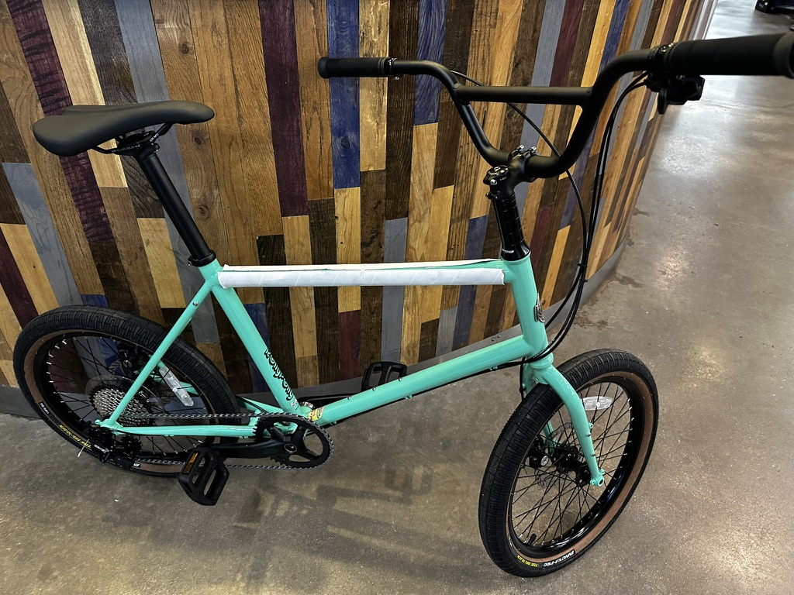

I got a new bike!. Its a BMX style minivelo made by Kyoot.

Honestly I hate big bikes. It seems thats mostly what you see especially at a bike shop. And they seem to just be getting bigger and bigger. I've seen bikes on youtube with 32" wheels and huge frames. Rediculous.

This Rolly Polly fits me pretty well. 10 speeds for my hilly area.

The color is called Iced Matcha. I'm going to kit it out with purple accents. Pedals, headset, water cage bolts. Gonna look good.

